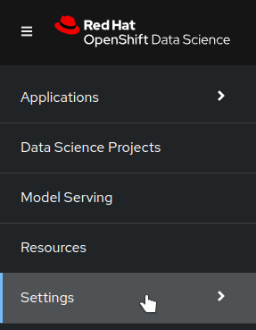
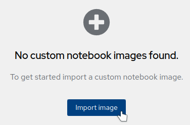
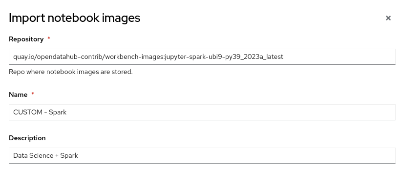
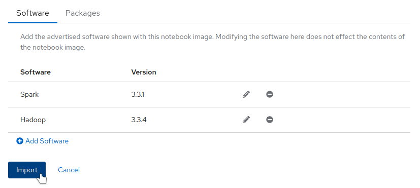
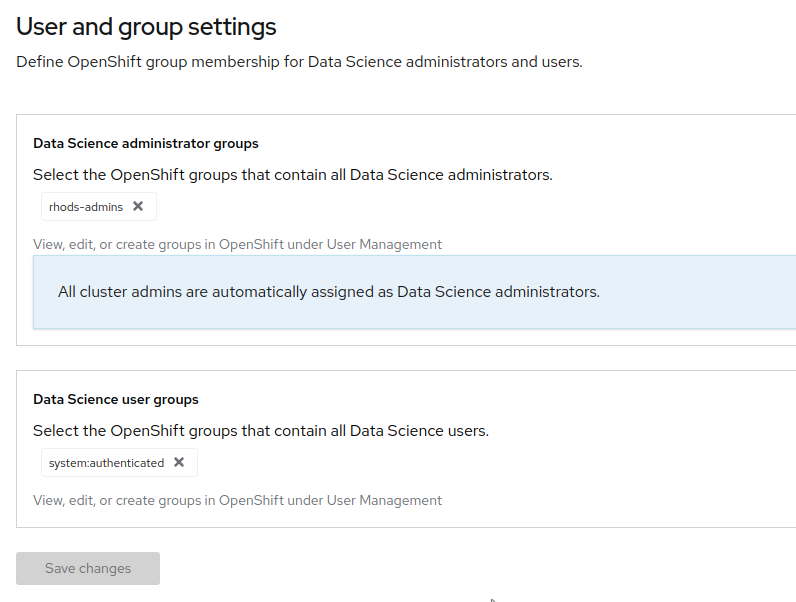
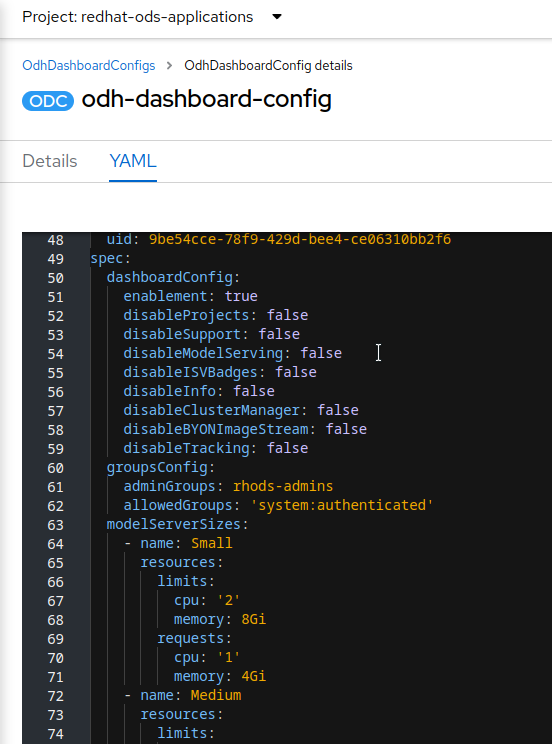
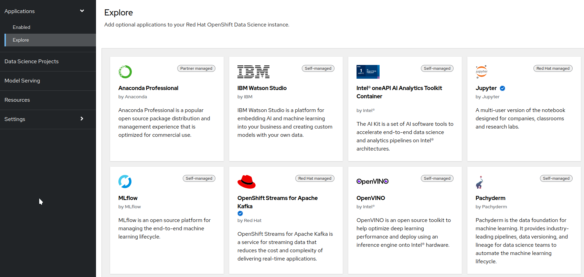
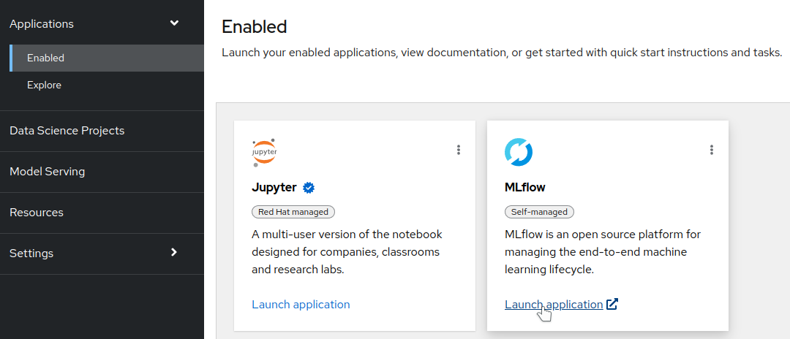

# ODH and RHOAI Configuration

## Standard configuration

As an administrator of ODH/RHOAI, you have access to different settings through the Settings menu on the dashboard:

{ style="width:200px"}

### Custom notebook images

This is where you can import other notebook images. You will find resources on available custom images and learn how to create your own in the [Custom Notebooks](custom-notebooks.md) section.

To import a new image, follow those steps.

- Click on import image.

{ style="width:300px"}

- Enter the full address of your container, set a name (this is what will appear in the launcher), and a description.



- On the bottom part, add information regarding the software and the packages that are present in this image. This is purely informative.



- Your image is now listed and enabled. You can hide it without removing it by simply disabling it.


- It is now available in the launcher, as well as in the Data Science Projects.

{ style="width:600px"}

### Cluster settings

In this panel, you can adjust:

- The default size of the volumes created for new users.
- Whether you want to stop idle notebooks and, if so, after how much time.
!!! note
    This feature currently looks at running Jupyter kernels, like a Python notebook. If you are only using a Terminal, or another IDE window like VSCode or RStudio from the [custom images](custom-notebooks.md), this activity is not detected and your Pod can be stopped without notice after the set delay.
- Whether you allow usage data to be collected and reported.
- Whether you want to add a toleration to the notebook pods to allow them to be scheduled on tainted nodes. That feature is really useful if you want to dedicate specific worker nodes to running notebooks. Tainting them will prevent other workloads from running on them. Of course, you have to add the toleration to the pods.


### User management

In this panel, you can edit who has access to RHOAI by defining the "Data Science user groups", and who has access to the Settings by defining the "Data Science administrator groups".



## Advanced configuration

### Dashboard configuration

RHOAI or ODH main configuration is done through a Custom Resource (CR) of type `odhdashboardconfigs.opendatahub.io`.

- To get access to it, from your OpenShift console, navigate to Home->API Explorer, and filter for `OdhDashboardConfig`:


- Click on `OdhDashboardConfig` and in the Instances tab, click on `odh-dashboard-config`:


- You can now view and edit the YAML file to modify the configuration:



In the `spec` section, the following items are of interest:

- `dashboardConfig`: The different toggles will allow you to activate/deactivate certain features. For example, you may want to hide Model Serving for your users or prevent them from importing custom images.
- `notebookSizes`: This is where you can fully customize the sizes of the notebooks. You can modify the resources and add or remove sizes from the default configuration as needed.
- `modelServerSizes`: This setting operates on the same concept as the previous setting but for model servers.
- `notebookController`: In this section you will find various settings related to the Workbenches and how they are launched.
- If your GPUs are not correctly detected, the dropdown allowing you to select how many GPUs you want to use for a workbench will not be displayed. To force it, you can create/modify the parameter `gpuSetting` under `notebookController`. This will force the dropdown to appear, with the maximum being the number you set for the parameter. Example:

```yaml
notebookController:
    enabled: true
    gpuSetting: '4'
    ...
```


### Adding a custom application

Let's say you have installed another application in your cluster and want to make it available through the dashboard. That's easy! A tile is, in fact, represented by a custom resource (CR) of type `OdhApplication`.

In this example, we will add a tile to access the MLFlow UI (see the [MLFlow installation](../tools-and-applications/mlflow/mlflow.md) instructions to test it).

- The file [mlflow-tile.yaml](mlflow-tile.yaml){:target="_blank"} provides you with an example of how to create the tile.
- Edit this file to set the `route` (the name of the Route CR) and `routeNamespace` parameters to where the UI is accessible. In this example, it is `mlflow-server`(route name) and `mlflow` (server). Apply this file to create the resource.
- Wait 1-2 minutes for the change to take effect. Your tile is now available in the Explore view (bottom left):



- However, it is not yet enabled. To enable this tile, click on it in the Explorer view, then click the "Enable" button at the top of the description. You can also create a ConfigMap from the file [cm-mlflow-enable.yaml](cm-mlflow-enable.yaml){:target="_blank"}.
- Wait another 1-2 minutes, and your tile is now ready to use in the Enabled view:


